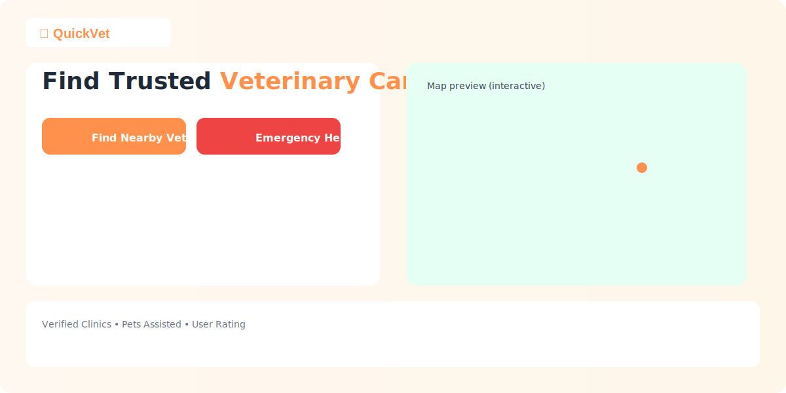

<div align="center">
  
  
  # QuickVet
  
  **India's first interactive veterinary assistance platform** — locate nearby veterinarians, request emergency assistance, book home visits, and manage pet healthcare across Bengaluru.

  [](https://quick-vet.vercel.app)
  [](https://quickvet.onrender.com)
  [](https://supabase.com)
</div>

---

## Screenshots

<div align="center">
  <table>
    <tr>
      <td align="center"><b>Landing Page & Hero</b></td>
      <td align="center"><b>Interactive Map View</b></td>
    </tr>
    <tr>
      <td></td>
      <td></td>
    </tr>
    <tr>
      <td align="center"><b>User Dashboard</b></td>
      <td align="center"><b>Booking Modal</b></td>
    </tr>
    <tr>
      <td></td>
      <td></td>
    </tr>
    <tr>
      <td align="center"><b>Emergency Assistance</b></td>
      <td align="center"><b>Admin Dashboard</b></td>
    </tr>
    <tr>
      <td></td>
      <td></td>
    </tr>
  </table>
</div>

> **Note:** To add screenshots, place PNG images in `assets/screenshots/` with the filenames shown above.

---

## Features

### For Pet Owners
- **Find Nearby Vets** — Interactive Leaflet map with Haversine distance filtering
- **Book Appointments** — Schedule clinic visits or home doctor consultations
- **Emergency Assistance** — One-click trauma alert broadcasting to nearby clinics
- **Pet Profiles** — Register pets with medical history, allergies, and booster records
- **Favorite Clinics** — Bookmark trusted veterinary stations for quick access
- **Review System** — Rate and review clinics after visits

### For Veterinarians
- **Doctor Portal** — Manage incoming bookings, approve/reject appointments
- **Emergency Dispatch** — Claim and respond to nearby emergency alerts
- **Home Visit Management** — Track dispatched home doctor visits
- **Clinic Registration** — Register your practice on the interactive map
- **Patient Reviews** — Monitor feedback and satisfaction scores

### For Administrators
- **Verification Queue** — Review and approve veterinarian registrations
- **User Management** — Search, suspend, or ban accounts
- **Analytics Dashboard** — Platform-wide statistics and growth metrics
- **Activity Logs** — Complete audit trail of all admin actions
- **Emergency Monitoring** — Real-time emergency request oversight
- **Fraud Detection** — Flag duplicate licenses, suspicious patterns

---

## Tech Stack

| Layer | Technology |
|-------|-----------|
| **Frontend** | React 19, Vite 6, Tailwind CSS v4, Motion (Framer), Lucide Icons |
| **Backend** | Node.js, Express 4, TypeScript |
| **Database** | PostgreSQL (Supabase), Drizzle ORM |
| **Authentication** | Custom JWT (HS256), bcryptjs password hashing |
| **Maps** | Leaflet + OpenStreetMap (CARTO tiles) |
| **Deployment** | Vercel (frontend) + Render (backend) + Supabase (database) |

---

## Architecture

```
┌──────────────────┐        ┌──────────────────┐        ┌──────────────────┐
│   VERCEL          │        │   RENDER          │        │   SUPABASE       │
│   (Frontend)      │──API──▶│   (Backend)       │──SQL──▶│   (PostgreSQL)   │
│                   │        │                   │        │                  │
│ • React SPA       │        │ • Express Server  │        │ • 7+ Tables      │
│ • Tailwind CSS    │        │ • JWT Auth        │        │ • Indexes        │
│ • Leaflet Maps    │        │ • Drizzle ORM     │        │ • FK Constraints │
│ • Motion Anims    │        │ • CORS Middleware  │        │ • Connection Pool│
└──────────────────┘        └──────────────────┘        └──────────────────┘
```

### Security Architecture

```
User Request → Bearer Token (Authorization Header)
                    ↓
        authenticateToken() middleware
                    ↓
            JWT Verification (HS256)
                    ↓
          requireRole() middleware
                    ↓
        Tenant Isolation (SQL WHERE clauses)
                    ↓
    Pet owners see ONLY their data
    Vets see ONLY their clinic's data
    Admins see everything
```

### Database ER Diagram

```
users 1──* pets
users *──* vet_clinics (via favorite_clinics)
users 1──* bookings
users 1──* emergency_requests
vet_clinics 1──* bookings
vet_clinics 1──* clinic_reviews
vet_clinics 1──* emergency_requests (accepted_by)
vet_clinics 1──* verification_documents
activity_logs ──* users (admin actions)
```

---

## Getting Started

### Prerequisites

- Node.js 18+
- PostgreSQL database (or free Supabase/Neon account)

### Local Development

```bash
# 1. Clone the repository
git clone https://github.com/Abhishek-gupta18/QuickVet.git
cd QuickVet

# 2. Install dependencies
npm install

# 3. Configure environment
cp .env.example .env
# Edit .env with your DATABASE_URL and JWT_SECRET

# 4. Push schema to database
npm run db:push

# 5. Seed demo data
npm run db:seed

# 6. Start development server
npm run dev
```

Open [http://localhost:3000](http://localhost:3000) in your browser.

### Demo Accounts

| Role | Email | Password |
|------|-------|----------|
| Pet Owner | `owner@gmail.com` | `password` |
| Veterinarian | `vet@gmail.com` | `password` |
| Admin | `admin@quickvet.in` | `admin123` |

---

## Deployment

### Production Architecture

| Service | Platform | Purpose |
|---------|----------|---------|
| Frontend | [Vercel](https://vercel.com) | Static React SPA hosting |
| Backend | [Render](https://render.com) | Express API server |
| Database | [Supabase](https://supabase.com) | Managed PostgreSQL |

### Environment Variables

#### Backend (Render)
```env
DATABASE_URL=postgresql://...@supabase.com:5432/postgres
JWT_SECRET=your-strong-secret-key-min-32-chars
FRONTEND_URL=https://quick-vet.vercel.app
NODE_ENV=production
NODE_TLS_REJECT_UNAUTHORIZED=0
```

#### Frontend (Vercel)
```env
VITE_API_URL=https://quickvet.onrender.com
```

### Build Commands (Render)
```
Build: npm install && npm run build && npx drizzle-kit push --force && npm run db:seed
Start: npm run start
```

---

## Project Structure

```
QuickVet/
├── server.ts                    # Express backend (API routes + Vite middleware)
├── drizzle.config.ts            # Drizzle Kit configuration
├── src/
│   ├── App.tsx                  # Main React app (state, routing, views)
│   ├── types.ts                 # TypeScript interfaces
│   ├── data.ts                  # Seed data + Haversine formula
│   ├── index.css                # Tailwind + custom styles
│   ├── main.tsx                 # React entry point
│   ├── server/
│   │   ├── schema.ts           # Drizzle ORM table definitions
│   │   ├── db.ts               # PostgreSQL connection pool
│   │   ├── jwt.ts              # Custom JWT sign/verify (HS256)
│   │   ├── middleware.ts       # authenticateToken + requireRole
│   │   └── seed.ts             # Database seed script
│   └── components/
│       ├── AdminDashboard.tsx   # Admin verification & management
│       ├── AuthModal.tsx        # Login/Signup/Reset forms
│       ├── BookingModal.tsx     # Appointment scheduling
│       ├── ClinicCard.tsx       # Clinic listing cards
│       ├── EmergencyWidget.tsx  # Emergency alert system
│       ├── Footer.tsx           # Site footer
│       ├── Hero.tsx             # Landing page hero section
│       ├── InteractiveMap.tsx   # Leaflet map integration
│       ├── Navbar.tsx           # Navigation bar
│       ├── ReviewsModal.tsx     # Clinic reviews
│       ├── UserDashboard.tsx    # Pet owner dashboard (5 tabs)
│       ├── VetDashboard.tsx     # Veterinarian portal
│       └── VetRegistrationModal.tsx # Clinic registration form
├── public/                      # Static assets (favicon, icons)
├── assets/                      # Preview images & screenshots
└── .env.example                 # Environment template
```

---

## API Endpoints

### Public
| Method | Path | Description |
|--------|------|-------------|
| POST | `/api/auth/signup` | Register new user |
| POST | `/api/auth/login` | Authenticate user |
| POST | `/api/auth/reset-password` | Reset password |
| GET | `/api/clinics` | List all clinics |
| GET | `/api/clinics/:id/reviews` | Get clinic reviews |

### Protected (JWT Required)
| Method | Path | Description |
|--------|------|-------------|
| POST | `/api/clinics` | Register new clinic |
| POST | `/api/clinics/:id/reviews` | Submit review |
| GET | `/api/bookings` | Get user/clinic bookings |
| POST | `/api/bookings` | Create booking |
| POST | `/api/bookings/:id/status` | Update booking status (vet) |
| GET | `/api/emergency` | Get emergencies |
| POST | `/api/emergency` | Create emergency |
| POST | `/api/emergency/:id/status` | Update emergency (vet) |
| POST | `/api/user/favorites` | Toggle favorite clinic |
| POST | `/api/user/pets` | Add pet profile |
| GET | `/api/user/me` | Get current user profile |

### Admin (JWT + Admin Role Required)
| Method | Path | Description |
|--------|------|-------------|
| GET | `/api/admin/stats` | Platform analytics |
| GET | `/api/admin/verification-queue` | Pending vet applications |
| POST | `/api/admin/verify/:id` | Approve/reject vet |
| GET | `/api/admin/users` | List all users |
| POST | `/api/admin/users/:id/status` | Suspend/ban user |
| GET | `/api/admin/activity-logs` | Audit trail |
| GET | `/api/admin/emergencies` | All emergencies |
| GET | `/api/admin/bookings` | All bookings |

---

## Contributing

1. Fork the repository
2. Create your feature branch (`git checkout -b feature/amazing-feature`)
3. Commit your changes (`git commit -m 'feat: add amazing feature'`)
4. Push to the branch (`git push origin feature/amazing-feature`)
5. Open a Pull Request

---

## License

This project is private and proprietary. All rights reserved.

---

<div align="center">
  <p>Built with care for every pet parent and veterinarian in India.</p>
  <p><b>QuickVet</b> &copy; 2026 | Made by <a href="https://github.com/Abhishek-gupta18">Abhishek Gupta</a></p>
</div>
